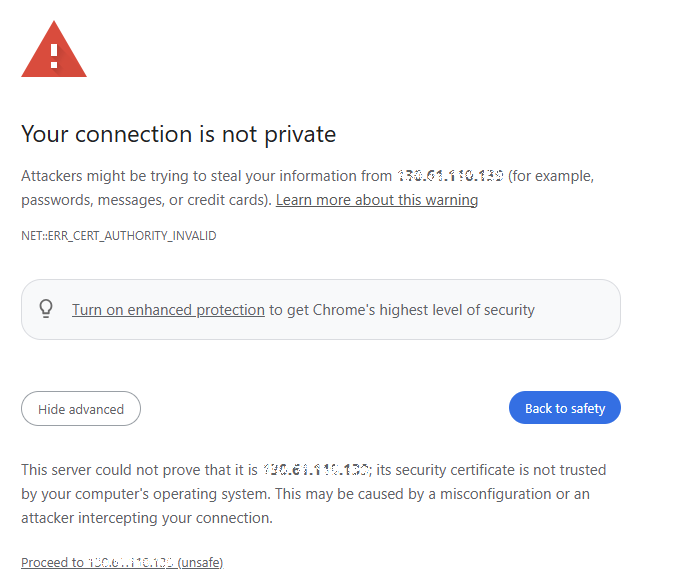
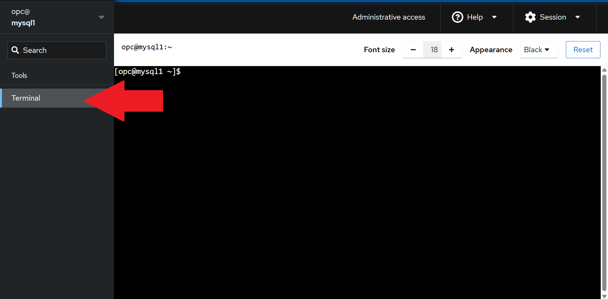
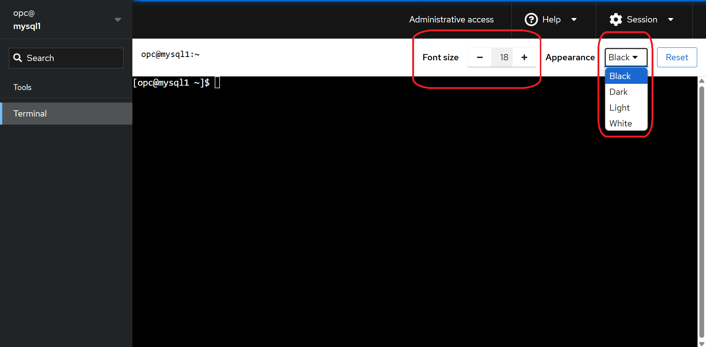
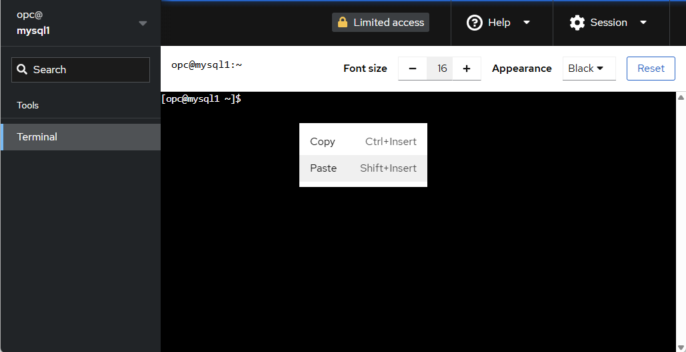
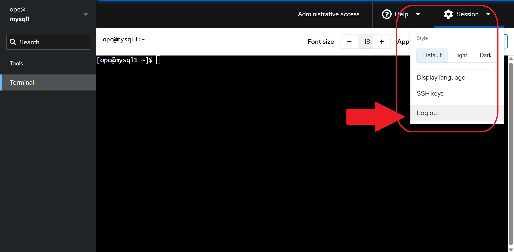

# WEB ACCESS - MYSQL ENTERPRISE EDITION

## Introduction

Instructions how to access workshop machines
Estimated Time: 15 minutes

### Objectives

In this lab, you will:

* Install MySQL Enterprise Edition
* Install MySQL Shell 
* Import a sample database


### Prerequisites

This lab assumes you have:
* A working Oracle Linux machine
* Environment created for MySQL Workshops

### Lab standard

Pay attention to the prompt, to know where execute the commands 
*  shell>  
  The command must be executed in the Operating System shell
*  mysql>  
  The command is SQL and must be executed in a client like MySQL, MySQL Shell or similar tool
*  mysqlsh>  
  The command must be executed in MySQL shell javascript command mode
  

## Task 1: Connect to your instance

> ***NOTE***
    To execute the labs you need to connect to your assigned server.  
    Servers are accessible through an SSH client (with the provided ssh key file).  
    For example, you can connect from linux or Windows Powershell with
    ```shell  
    ssh -i ~/.ssh/id_rsa opc@<your_server_public_ip>
    ```
    Please use this kind of connection if the web terminal is not available (e.g. if your company laptop prevent access web sites with self signed certificates)  


1. Open your web browser and connect to the address ***<code>https://<public-ip>:9090</code>***  
  Most probably you receive a warning becasue the interface uses a self signed certificate.  
  Please proceed anyway (in most cases it means to click "Advanced" and then "Proceed to ... (unsafe)")

  


2. At login form, insert ***'opc'*** as user name and the provided password.  
  Then click ***'log in'*** button

  


3. When logged in, you may have a "not found message". ignore it and click on ***'Terminal'*** from left side bar  

  


4. For a better visibility you can also change font size or background color.  

  


5. This web terminal let you also copy and paste commands with right/secondary click of your mouse.  

  


6. To logout, select ***'Session/Log out'*** from at the top right of the page.  

  


> ***NOTE***  
You can open as many sessions as you need, just opening a new web session.  
If you are using more than one connection, we suggest to use different background color to easily identify where you are working.  


You can now **proceed with your bootcamp or workshop**.

## Learn More

* [MySQL tutorial](https://dev.mysql.com/doc/refman/8.4/en/tutorial.html)

## Acknowledgements

* **Author** - Marco Carlessi, Principal Sales Consultant
* **Last Updated By/Date** - Marco Carlessi, MySQL Solution Engineering, January 2025

