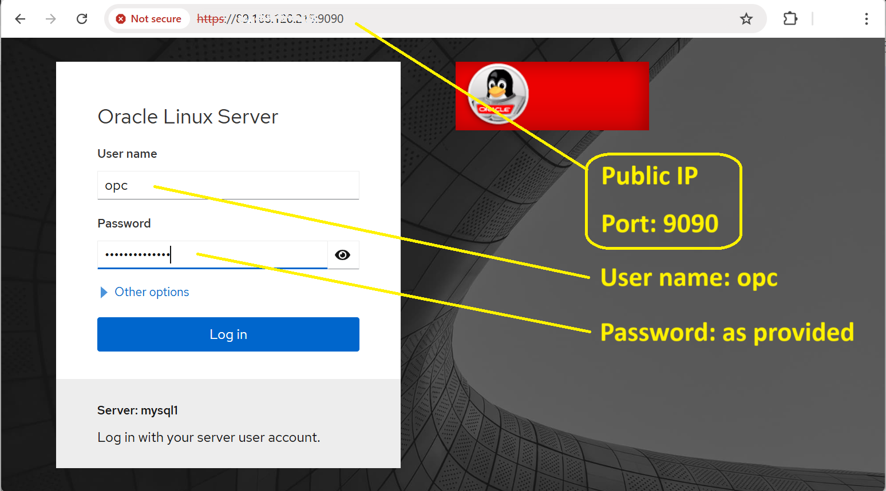

# MYSQL SQL STORE PROGRAMMING - OVERVIEW  

## Introduction
MySQL store programming is traditionally based on stored procedures and functions written in SQL.  
We recap here how to create and use stored procedures and stored functions them.

Goal:
- Create SQL stored procedures
- Create SQL stored functions

Estimated Time:  10 minutes

### Objectives

In this lab, you will:

- Recap SQL store programming

### Prerequisites

This lab assumes you have:

- All previous labs successfully completed

### Lab standard

Pay attention to the prompt, to know where execute the commands 
*  shell>  
  The command must be executed in the Operating System shell
*  mysql>  
  The command is SQL and must be executed in a client like MySQL, MySQL Shell or similar tool
*  mysqlsh>  
  The command must be executed in MySQL shell javascript command mode
*  mysqlsh>  
  The command must be executed in MySQL shell python command mode

## Task 1: SQL Store procedures - hello world

1. Connect to your **server** instance using your web browser

    


2. Now connect yo your MySQL instance

  ** mysqlsh>**
  ```sql
  <copy>mysqlsh root@localhost</copy>
  ```

3. Let's create a database for our store programs

  ** mysqlsh>**
  ```sql
  <copy>CREATE DATABASE test;</copy>
  ```

4. Set the database as default for our store programming

  ** mysqlsh>**
  ```sql
  <copy>USE test;</copy>
  ```

5. A **stored procedure** is an object created with CREATE PROCEDURE and invoked using the CALL statement. This object contains a set of instructions that are executed as a program.  
  A procedure **does not have a return value**, but can modify its parameters for later inspection by the caller. It can also generate result sets to be returned to the client program.  
  Let's create a simple one specifying (***expect an error message!***) 
  * CREATE PROCEDURE <name of the procedure>()
  * BEGIN to start the code block
  * END to end to block code
  * SELECT "Hello World" as first command 

  ** mysqlsh>**
  ```sql
  <copy>
  CREATE PROCEDURE helloworld_sql()
  BEGIN
    SELECT "Hello World";
  END;
  </copy>
  ```

  **OUTPUT:**
  ```
  ERROR: 1064 (42000): You have an error in your SQL syntax; check the manual that corresponds to your MySQL server version for the right syntax to use near '' at line 3
  
   MySQL  127.0.0.1:3306 ssl  test  SQL >   END;
  ERROR: 1064 (42000): You have an error in your SQL syntax; check the manual that corresponds to your MySQL server version for the right syntax to use near 'END' at line 1
  ```

6. From the previous command you will receive an error, because the default termination of the commands (";") execute them immediately.  
  For this reason, we need to define an alternative command terminator to use ';' inside our code when we create stored procedures or functions (SQL or js). 
  Let set it now.

  ** mysqlsh>**

  ```
  <copy>DELIMITER //</copy>
  ```

7. Now we can insert our store procedure code.  
  Please note that after ***this code is not executed and the last line is waiting input with '-> '*** is not returned. To apply we need to go with the next step.

  ** mysqlsh>**
  ```sql
  <copy>
  CREATE PROCEDURE helloworld_sql()
  BEGIN
    SELECT "Hello World";
  END;
  </copy>
  ```

8. Now execute the commands just inserted using the new terminator

  ** mysqlsh>**
  ```
  <copy>//</copy>
  ```

9. And restore the default terminator character, to simplify our activities.

  ** mysqlsh>**

  ```sql
  <copy>DELIMITER ;</copy>
  ```

10. Our first stored procedure is created, and we are now ready to execute it using the 'CALL' command.

  ** mysqlsh>**

  ```sql
  <copy>CALL helloworld_sql;</copy>
  ```

  **OUTPUT:**
  ```
  +-------------+
  | Hello World |
  +-------------+
  | Hello World |
  +-------------+
  1 row in set (0.0021 sec)
  ```

## Task 2: SQL Store procedures - parameters and variables

1. Parameter for stored procedures are defined as MySQL data type and can be passed as 
  * IN, parameter is passed to the stored procedure by value
  * OUT, parameter is passed to the stored procedure by reference, so it's initially cleared and used to return values
  * INOUT, parameter is not initially cleared, but used tor return values
  
  Let's now drop the previous stored procedure to rewrite it

  ** mysqlsh>**

  ```
  <copy>DROP PROCEDURE IF EXISTS helloworld_sql;</copy>
  ```

2. Recreate the stored procedure to use a parameter.
  Note that other functions can be used inside the code.

  ** mysqlsh>**

  ```
  <copy>
  DELIMITER //

  CREATE PROCEDURE helloworld_sql(IN name VARCHAR(50))
    BEGIN
    select concat("Hello world from ", name);
  END;
  
  //

  DELIMITER ;
</copy>
  ```

3. Check the result

  ** mysqlsh>**
  ```
  <copy>CALL helloworld_sql('Goofy');</copy>
  ```

  **OUTPUT:**
  ```
  +-----------------------------------+
  | concat("Hello world from ", name) |
  +-----------------------------------+
  | Hello world from Goofy            |
  +-----------------------------------+
  ```

4. When you specify a parameter, you need to use it in the stored procedure invocation, otherwise you have an error.  
  Let's test it

  ** mysqlsh>**
  ```
  <copy>CALL helloworld_sql();</copy>
  ```

  **OUTPUT:**
  ```
  ERROR: 1318 (42000): Incorrect number of arguments for PROCEDURE test.helloworld; expected 1, got 0
  ```

5. You can also use variables to store values during the program execution. Use DECLARE to initialize  and SET to assign values

  ** mysqlsh>**
  ```
  <copy>
  DROP PROCEDURE IF EXISTS helloworld_sql;
  
  DELIMITER //

  CREATE PROCEDURE helloworld_sql(IN name VARCHAR(50))
    BEGIN
    DECLARE msg VARCHAR(20) DEFAULT '';

    SET msg="Hello world from ";
    select concat(msg, name);
  END;
  
  //

  DELIMITER ;

  </copy>
  ```

6. Check the result

  ** mysqlsh>**
  ```
  <copy>CALL helloworld_sql('Goofy');</copy>
  ```

  **OUTPUT:**
  ```
  +-----------------------------------+
  | concat("Hello world from ", name) |
  +-----------------------------------+
  | Hello world from Goofy            |
  +-----------------------------------+
  ```

## Task 3: SQL Store procedures - Control flow

1. Execution flow control can be controlled with various commands (IF/THEN/ELSE, WHILE, DO/LOOP...). It's out of scope to discuss all of them here, so let's play with some as a simple recap

  ** mysqlsh>**
  ```sql
  <copy>
  DROP PROCEDURE IF EXISTS helloworld_sql;
  
  DELIMITER //

  CREATE PROCEDURE helloworld_sql(IN name VARCHAR(50))
  BEGIN

    IF name = '' OR name IS NULL then
      SELECT ('Hello world from from anonymous') as message;
    ELSE
      SELECT CONCAT('Hello world from from ', name) as message;
    END IF;
  END;
  
  //

  DELIMITER ;
  </copy>
  ```

2. Check the result with a name

  ** mysqlsh>**
  ```sql
  <copy>CALL helloworld_sql('Goofy');</copy>
  ```

  **OUTPUT:**
  ```
  +-----------------------------------+
  | message                           |
  +-----------------------------------+
  | Hello world from Goofy            |
  +-----------------------------------+
  ```

3. Check the result with an empty string

  ** mysqlsh>**
  ```sql
  <copy>CALL helloworld_sql('');</copy>
  ```

  **OUTPUT:**
  ```
  +---------------------------------+
  | message                         |
  +---------------------------------+
  | Hello world from from anonymous |
  +---------------------------------+
  ```

## Task 4: SQL Store functions

1. A **stored function** is an object created with CREATE FUNCTION and invoked like a native function. This object contains a set of instructions that are executed as a program.  
  A function can **return value** and can have parameters.   
  Now we create a simple one specifying
  * CREATE FUNCTION <name of the function>()
  * BEGIN to start the code block
  * END to end to block code
  * Return an "Hello World" message 
  You see that it's very similar to stored procedure


** mysqlsh>**
  ```sql
  <copy>
  DELIMITER //

  CREATE FUNCTION helloworld_sqlf(name VARCHAR(50)) RETURNS CHAR(50) DETERMINISTIC
  BEGIN
    DECLARE message CHAR(50) DEFAULT '';
    
    IF name = '' OR name IS NULL then
      set message = 'Hello world from from anonymous';
    ELSE
      set message= CONCAT('Hello world from from ', name);
    END IF;

    return message;
  END;
  
  //

  DELIMITER ;
  </copy>
  ```

2. Check the result with an empty string

  ** mysqlsh>**
  ```sql
  <copy>SELECT helloworld_sqlf('') AS message;</copy>
  ```

  **OUTPUT:**
  ```
  +---------------------------------+
  | message                         |
  +---------------------------------+
  | Hello world from from anonymous |
  +---------------------------------+
  ```

3. Check the result with a value for the parameter

  ** mysqlsh>**
  ```sql
  <copy>SELECT helloworld_sqlf('Goofy') AS message;</copy>
  ```

  **OUTPUT:**
  ```
  +-----------------------------+
  | message                     |
  +-----------------------------+
  | Hello world from from Goofy |
  +-----------------------------+
  ```

4. Of course you can also write a query, for example to extract the population ratio of a specific country
  SQL comments are written with '--'  

  ** mysqlsh>**
  ```sql
  <copy>
  DELIMITER //

  CREATE FUNCTION pop_percentage(c_code CHAR(3)) RETURNS DECIMAL(4,2) DETERMINISTIC
  BEGIN
    DECLARE worldpop, cpop BIGINT;

    -- Sum the total population
    SELECT SUM(population) FROM world.country INTO worldpop;
    -- Retrieve the population fo the country
    SELECT population FROM world.country WHERE CODE = c_code INTO cpop;
    -- Return the percentage
    RETURN cpop / worldpop * 100;
  END

  //

  DELIMITER ;
  </copy>
  ```


5. Now let's write a more complex function, to calculate the greatest common divisor  

  ** mysqlsh>**
  ```sql
  <copy>
  DROP FUNCTION IF EXISTS gcd_sql;
  DELIMITER //

  CREATE FUNCTION gcd_sql(x int, y int) RETURNS int DETERMINISTIC
  BEGIN
    DECLARE dividend int;
    DECLARE divisor int;
    DECLARE remainder int;

    -- Return the larger and the smaller, so the MOD operation make sense
    SET dividend := GREATEST(x, y);
    SET remainder := LEAST(x, y);

    WHILE remainder != 0 DO
      SET divisor = remainder;
      SET remainder = MOD(dividend, divisor);
      SET dividend = divisor;
    END WHILE;

    RETURN divisor;
  END

  //

  DELIMITER ;
  </copy>
  ```

6. Check the result with a value for the parameter

  ** mysqlsh>**
  ```sql
  <copy>SELECT gcd_sql(10,5) AS gcd;</copy>
  ```

  **OUTPUT:**
  ```
  +-----+
  | gcd |
  +-----+
  |   5 |
  +-----+
  ```

## Task 5: SQL stored procedure - error handling

1. Let's start creating a table with usernames

  ** mysqlsh>**
  ```sql
  <copy>CREATE TABLE myusers (user_id INT AUTO_INCREMENT PRIMARY KEY, username VARCHAR(50) UNIQUE NOT NULL);</copy>
  ```

2. Now create a stored procedure to insert usernames.

  ** mysqlsh>**
  ```sql
  <copy>
  DELIMITER //

  CREATE PROCEDURE insert_user(IN p_username VARCHAR(50))
  BEGIN
    INSERT INTO myusers (username) VALUES (p_username);
    SELECT concat ('User ', p_username,' inserted successfully') AS Message; 
  END

  //

  DELIMITER ;
  </copy>
  ```

3. Now we can insert a new username.

  ** mysqlsh>**
  ```sql
  <copy>CALL insert_user('Goofy');</copy>
  ```

  **OUTPUT:**
  ```
  +----------------------------------+
  | Message                          |
  +----------------------------------+
  | User Goofy inserted successfully |
  +----------------------------------+
  ```

4. But in case of duplicate, the procedure stop the execution with an error

  ** mysqlsh>**
  ```sql
  <copy>CALL insert_user('Goofy');</copy>
  ```

  **OUTPUT:**
  ```
  ERROR: 1062 (23000): Duplicate entry 'Goofy' for key 'myusers.username'
  ```

5. Let's delete the stored procedure to re-create it

  ** mysqlsh>**
  ```sql
  <copy>DROP PROCEDURE insert_user;</copy>
  ```

6. Now we can specify a section 'DECLARE ... HANDLER' to catch specific errors and in a dedicated 'BEGIN...END' section execute actions, without abruptly stop the stored procedure execution.

  ** mysqlsh>**
  ```sql
  <copy>
  DELIMITER //
  CREATE PROCEDURE insert_user(IN p_username VARCHAR(50))
  BEGIN
    -- SQLSTATE for unique constraint violation is 23000
    DECLARE EXIT HANDLER FOR SQLSTATE '23000'
    BEGIN
        -- When a duplicate key is detected show a message
        SELECT 'Error: Duplicate username. Please choose a different username.' AS Message;
    END;

    INSERT INTO myusers (username) VALUES (p_username);
    SELECT concat ('User ', p_username,' inserted successfully') AS Message;
  END
  //
  DELIMITER ;
  </copy>
  ```

7. Check now the new behavior in case of duplicate.

  ** mysqlsh>**
  ```sql
  <copy>CALL insert_user('Goofy');</copy>
  ```

  **OUTPUT:**
  ```
  +----------------------------------------------------------------+
  | Message                                                        |
  +----------------------------------------------------------------+
  | Error: Duplicate username. Please choose a different username. |
  +----------------------------------------------------------------+
  ```

You can now **proceed to the next lab**

## Learn More

* [Defining Stored Programs](https://dev.mysql.com/doc/refman/9.2/en/stored-programs-defining.html)

## Acknowledgements

* **Author** - Marco Carlessi, Principal Sales Consultant
* **Last Updated By/Date** - Marco Carlessi, MySQL Solution Engineering, January 2025
